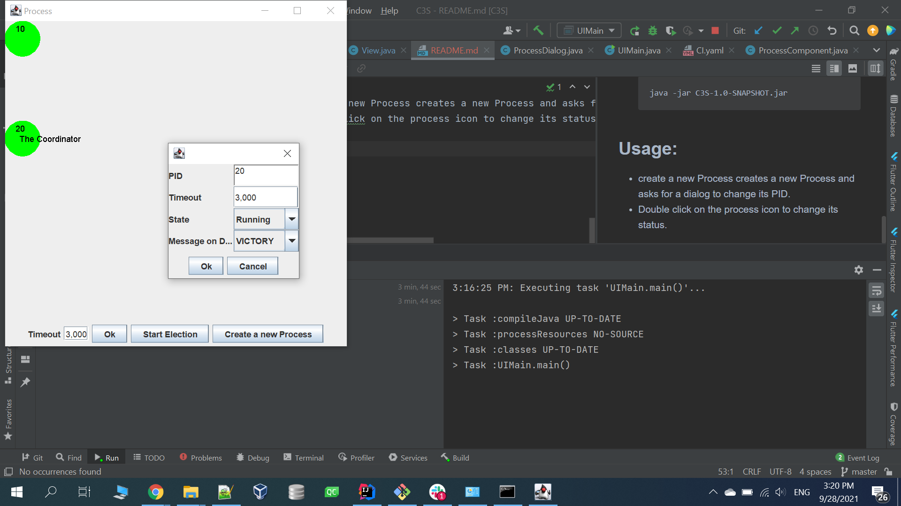

# J-Customer app.


## Quick start
- The application Simulates The BULLY Algorithm
- **Download the jar file from the CI Build on Github**

## Dependencies
- **Java 11 or higher**


## Project structure
```
├───build
│   ├───classes
│   ├───generated
│   ├───libs //Output jar file
│   └───tmp
│      
└───src
    ├───main
    │   ├───java
    │   │   └───com
    │   │       └───icraus
    │   │           ├───jprocess/JProcess.java contains the algorthim implementation.
    │   │           ├───utils
    │   │           └───views
    │   └───resources
    └───test
        ├───java
        │   └───com
        │       └───icraus
        └───resources

```
## Getting started with Backend:
- clone the project using.
  ```
    git clone https://github.com/Icraus/bully.git -b master
  ```
- build
  ```
  gradlew :build :jar //should run unittest, build and create Jar File
  ```
- run
    ```
    java -jar C3S-1.0-SNAPSHOT.jar
    ```
## Usage:

- create a new Process creates a new Process and asks for a dialog to change its PID. 
- Double click on the process icon to change its status.



## Known bugs

- Due to java thread timing issues u might find some issues in the election and timeout
  if that happened just lower the time of the running process less than the exact needed time.